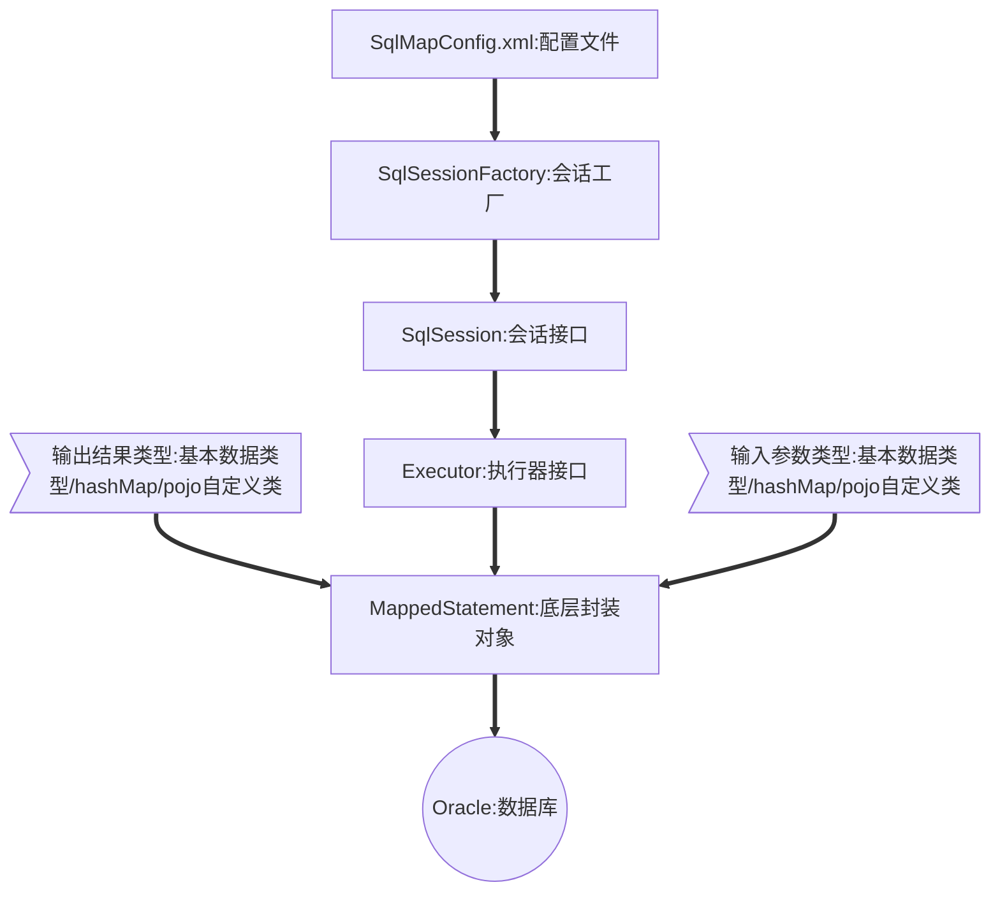

# 1.0 JAVASE

## 1.1 String

### 1.1.1 String类中的常用方法

| 方法名                       | 作用                                                         |
| ---------------------------- | ------------------------------------------------------------ |
| length()                     | 返回字符串中字符的个数                                       |
| concat(String str)           | 将传入的参数拼接到调用者尾部                                 |
| endsWith(String str)         | 检测调用者字符串是否与参数传入的字符串结尾                   |
| indexOf(String/int)          | 返回指定字符或者数字或者字符串在调用者字符串中第一次出现的位置 |
| isEmpty()                    | 如果字符串字符个数为0，返回true。                            |
| split(String str)            | 使用参数中指定的字符串切割调用者字符串，生成一个String数组返回 |
| startsWith(String str)       | 检测调用者字符串是否以参数传入的字符串开头                   |
| subString(int start,int end) | 根据下标找出调用者字符串指定位置的子字符串返回               |
| equals(String str)           | 重写Object类中的方法，用于比较两个字符串中的内容是否相同     |

### 1.1.2 存储机制及避免缺陷的方式

String字符串存在两种创建方式：

1. String str = "hello";
2. String str = new String("hello");

第一种创建对象的方式，会将String字符串创建到串池中，当下次创建同样的字符串的时候，会先在串池中查看是否存在此字符串，如果已经存在则直接将字符串所在的地址抛出给引用。

第二种创建对象的方式将字符串创建在对象中，每个字符串拥有独立的空间，相同的字符串也将拥有单独的空间。

**缺陷**

采用直接赋值的情况创建的字符串在进行字符串拼接的时候，会生成新的地址（创建新的字符串），新的字符串表示的是拼接之后的样子，之前的地址将变成内存垃圾，由垃圾回收器（finalize）进行自动回收。

String字符串主要的缺陷就是：无法避免空间浪费的问题。

**解决方式**

可以采用StringBuffer（存在缓冲区的字符串）创建字符串，使用append方法进行字符串的拼接，使用toString方法导出字符串为String类型，这样在进行字符串拼接的时候就只会创建一个对象，不存在资源浪费和出现内存垃圾的情况。

### 1.1.3 如何将String字符串变成一个数组

| 方法                | 介绍                                                         |
| ------------------- | ------------------------------------------------------------ |
| toCharArray()       | 将此字符串转换为一个新的字符数组。                           |
| split(String regex) | 根据给定正则表达式的匹配拆分此字符串。                       |
| getBytes()          | 使用平台的默认字符集将此 String 编码为 byte 序列，并将结果存储到一个新的 byte 数组中。 |

### 1.1.4 String、StringBuffer、StringBuilder之间的区别

**String**

一个不可变长的字符串对象，这与StringBuffer和StringBuilder所不同。

在进行字符串拼接的时候，字符串并没有发生改变，而是创建了新的字符串，将原先的内容拷贝到其中，从而看起来像是变长了，但是已经出现了两个对象。

**StringBuffer**

可变长字符串（存在缓冲区的字符串），是一个线程安全的字符串对象，处理效率相对较低。

**StringBuilder**

可变长字符串，是一个线程不安全的字符串对象，处理效率相对较高。

## 1.2 数据类型

### 1.2.1 基本数据类型及占用字节数

| 数据类型             | 占用字节数 |
| -------------------- | ---------- |
| byte：字节类型       | 1B         |
| short：短整型        | 2B         |
| int：整型            | 4B         |
| long：长整型         | 8B         |
| double：双精度浮点型 | 8B         |
| float：单精度浮点型  | 4B         |
| char：字符类型       | 2B         |
| boolean：布尔类型    | 不确定     |

### 1.2.2 Java中存在几种数据类型

Java中存在两种数据类型，基本数据类型和对象数据类型。

基本数据类型有八种，对象数据类型有多种，凡是以类来创建的对象，都属于对象数据类型。

Java中的数组属于对象数据类型。

### 1.2.3 是否存在i+1<i这种情况

存在的：

​	在内存溢出（精度损失）的情况下会存在。

```java
public static void main(String[] args) {
    byte b = 127;
    byte a = 0;
    a = (byte)(b+1);
    System.out.println(a);
}
```

### 1.2.4 float转double会出现精度损失问题

float属于单精度浮点型，精度程度低于double装精度。

float类型的变量在转换成double时，缺席会被放大，从而出现精度损失。

```java
float f = 12.1f;
double d = f;
System.out.println(d);
//实例输出结果：12.100000381469727
```

### 1.2.5 如何处理精度损失问题

在Java中，将float类型变量转换成double类型变量的时候会出现精度损失的问题。

因为计算机进行的是二进制运算，我们输入的十进制数字会先转换成二进制，进行运算后再转换为十进制输出。Float和Double提供了快速的运算，然而问题在于转换为二进制的时候，有些数字不能完全转换，只能无限接近于原本的值，这就导致了在后来的运算会出现不正确结果的情况。

可以使用java中的java.math.BigDecimal代替double进行数存储，或者使用String字符串进行数据存储，都可以解决精度损失的问题。

## 1.3 包装类

### 1.3.1 作用，与基本类型之间的区别

包装类是将基本类型用对象类型的形式进行处理，让基本类型也拥有对象类型的功能。比如可以调用方法，调用属性等功能。

包装类与基本数据类型之间的区别就是，数据类型不同，包装类的功能更多。

| 基本数据类型 | 包装类型  |
| ------------ | --------- |
| byte         | Byte      |
| short        | Short     |
| int          | Integer   |
| long         | Long      |
| double       | Double    |
| float        | Float     |
| char         | Character |
| boolean      | Boolean   |

## 1.4 异常

### 1.4.1 异常的分类

Java中的异常分为：错误（Error）和异常（Exception），Java中的异常表示程序运行中意外的情况。比如：

1. 类找不到异常；
2. 数组下标越界异常；
3. 强转类型出错异常；
4. 算数异常；

Java中的Error和Exception都继承自Throwable类。

Java中的异常都无法解决，就像做错无法挽回，只能当整个程序的生命结束才能忘记。

### 1.4.2 异常的处理方式

**消极的处理方式：抛出**

如果方法的语句中出现异常，可以在方法的声明上通过的throws关键字抛出此异常。

当有引用调用此方法的时候，这个抛出的异常将经过调用的动作传到调用的位置，使这条语句出现异常。

这是一种消极的处理办法，因为异常没有被有效的制止并处理。

**积极的处理方式：捕获**

当语句可能会发生异常时，就将其写在try代码块中进行尝试运行。

如果try代码块中的代码真的出现了异常，程序会立马在语句中创建异常对象，其中封装了异常的信息。

此异常将被catch捕获，在catch代码块中进行挽救处理。

**无论是抛出还是捕获都无法使异常完全解决，只不过抛出没有做挽回，捕获存在挽回。**

### 1.4.2 自定义异常的方式

**继承Exception类**

自定义一个异常类，然后继承Exception类，在自己的构造方法中调用父类的构造方法，传入响应的异常消息从而创建异常。

```java
public class NoMappingParamString extends Exception {
    /*无参构造函数*/
    public NoMappingParamString(){
        super();
    }
    
    //用详细信息指定一个异常
    public NoMappingParamString(String message){
        super(message);
    }
    
    //用指定的详细信息和原因构造一个新的异常
    public NoMappingParamString(String message, Throwable cause){
        super(message,cause);
    }
    
    //用指定原因构造一个新的异常
    public NoMappingParamString(Throwable cause) {
        super(cause);
    }
}
```

在使用异常时，可以通过throw关键字来手动的抛出一个异常对象。

```java
throw new NoMappingParamString();
```

## 1.5 集合

### 1.5.1 Java集合的继承体系


### 1.5.2 及各个集合之间的区别

Collection：单个值存放的集合

| 集合名 | 类型             |
| ------ | ---------------- |
| List   | 有序可重复集合   |
| Set    | 无序不可重复集合 |

List：有序可重复的集合

| 集合名     | 类型                             |
| ---------- | -------------------------------- |
| ArrayList  | 底层是数组结构，增删慢，改查快。 |
| LinkedList | 底层是链表结构，增删快，改查慢。 |
| Vector     | 线程较为安全，但效率较低。       |

Map：以键值对存储的集合

| 集合名    | 类型                                                       |
| --------- | ---------------------------------------------------------- |
| HashMap   | 键不可重复，值可重复，线程不安全。键值对的存储不存在顺序。 |
| TreeMap   | 键和值都不能为空，线程不安全。键值对的存储存在顺序。       |
| HashTable | 线程安全，效率较低。                                       |

### 1.5.3 java中的几种遍历方式及适用场景

**for**

+ 适用于有序的List集合或数组

**foreach**

+ 适用于单个数据的List集合、数组。

**Iterator**

+ 适用于各种集合类对象。

### 1.5.4 如何遍历Map集合

`Map m = new HashMap();`

1. 首先获取到所Map中所有的key。

   因为Map集合中的key是不可重复的，所以一般使用Set集合来存储。

   `Set keys = m.keySet();`

2. 然后遍历key的集合从而获得value。

   在遍历Set集合的同时获取value。

   ```java
   public static void main(String[] args) {
       Map m = new HashMap();
       Set s = m.keySet();
       Iterator it = s.iterator();
       while(it.hasNext()){
           String key = (String)it.next();
           String value = (String)m.get(key);
       }
   }
   ```

## 1.6 方法与类

### 1.6.1 接口与抽象类之间的区别

+ 接口中的方法都是公开抽象的方法，属性都是公开静态的常量。
+ 接口可以继承多个父接口，而抽象类只能由一个父类或多个父接口。
+ 接口中不能存在非抽象方法，抽象类中可以存在非抽象方法。
+ 接口使用Interface来声明创建，抽象类使用abstract class创建。
+ 接口没有构造函数，抽象类存在构造函数。
+ 接口不能创建对象，抽象类不能同构new来创建对象。

### 1.6.2 当程序中存在静态内容和子父继承时创建对象的顺序

**创建对象的流程**

1. 给所有属性开辟空间，赋默认值。

2. 给所有属性赋初始值。

3. 调用构造方法。

   当存在构造代码块时，首先执行构造代码块。

**存在静态内容**

静态代码块在类加载时执行，且只执行一次。类加载包括：创建此类对象，创建此类子类的对象，调用类中的属性和方法。都会触发类加载，在此处说的是，在创建此类对象的时候如何执行。

1. 调用静态代码块
2. 给静态属性开辟空间赋默认值，然后赋初始值。
3. 调用构造代码块
4. 给普通属性开辟空间赋默认值，然后赋初始值。
5. 调用构造方法。

**存在子父类继承关系的时候**

1. 首先将子父类所有的属性全部开辟空间赋默认值。

2. 然后给父类赋初始值，调用父类构造方法。

3. 然后给子类赋初始值，调用子类构造方法。

   如果存在静态代码块，也是首先调用父类的静态代码块，然后调用子类的静态代码块，再执行以上操作。

*静态的内容优先级要高于普通内容的优先级，父类的成员的优先级要高于子类成员的优先级。*

### 1.6.3 Object类中所书写的方法及作用

toString：用于返回对象地址的十六进制表达方式。

equals：一般类会重写此方法用于比较对象内容是否相等，但在object类中，依然比较地址是否相等。

getClass：获得对象的运行时的实际类型。

finalize：垃圾回收器，将没有引用指向的对象进行回收，自动调用。

### 1.6.4 方法重写与重载的区别

**重写**

重写发生在子父类之间，子类中同名，同参，同返，访问修饰符与父类相同或宽于父类的方法，将会覆盖父类中的同名方法，在实际调用方法的时候，将调用子类覆盖父类后的方法。

**重载**

重载发生在同一个类中，一个类中允许存在多个同名的方法，但是方法的参数表的个数，顺序，类型不同则认定为不同的方法，在进行方法调用的时候，可以根据传入参数的不同调用不同的方法。

方法的重载与返回值无关。

### 1.6.5 三大修饰符及四大访问修饰符

**三大修饰符**

| 修饰符   | 修饰内容 | 特点                                                         |
| -------- | -------- | ------------------------------------------------------------ |
| static   | 属性     | 静态属性可以通过类名直接调用，静态属性只在类加载时创建一次，多次使用的静态属性是同一个地址下的。 |
|          | 方法     | 静态方法可以通过类名直接调用，静态方法中只能使用静态的成员（属性和方法），非静态方法里可以使用静态的成员。 |
| final    | 属性     | 终极属性称为常量，只能赋值一次，在初始化或者构造方法中赋值。常量没有默认值。 |
|          | 方法     | 终极方法无法被子类覆盖，会报出编译时异常。                   |
|          | 类       | 终极类无法被继承，终极类内的成员都由终极修饰。               |
| abstract | 类       | 抽象类中可以存在抽象方法和非抽象方法，抽象类的子类如果没有重写其中所有的抽象方法也要变成抽象类，抽象类存在构造方法。抽象类不能创建对象 |
|          | 方法     | 抽象方法没有方法体，只有方法的声明。抽象方法必须被重写。     |

**四大访问修饰符**（由宽到窄）

| 修饰符                        | 访问范围                           |
| ----------------------------- | ---------------------------------- |
| public：公开的                | 所有的类中均可使用                 |
| protected：受保护的           | 在本类、同包或者不同包的子类中使用 |
| 不写修饰符（default）：默认的 | 在本类、同包的类中使用             |
| private：私有的               | 仅能在本类中使用                   |

## 1.7 语言及面向对象

### 1.7.1 面向对象的三大特性及作用

+ 封装：

  起保护作用，让类的内容无法在类的外部调用。

  首先私有化属性，然后提供相应的get、set方法从而实现封装。

+ 继承：

  将所有子类的共性提取到父类中，从而减少子类的代码量，也保证了方法的统一。

  使用extends关键字指定本类的父类是哪一个，一个子类只能由一个父类，一个父类可以有多个子类。

+ 多态：

  屏蔽不同对象之间的差异。

  将子类类型的对象赋值给父类类型的引用，多态的三条原则为：对象类型不变，只能调用父类中声明过的方法，实际调用子类中重写后的方法。

  对象类型不变的意思是：及时将子类对象放到了父类类型的引用中，对象的类型还依然是子类类型，这点可以通过getClass方法来验证。

  *如果出现四个选框，则抽象也算一个，但一般不会纳入其中。*

### 1.7.2 java的优点及组成部分

**优点**

1. 简单性：相对于C，C++等其他高级语言，Java语言学习和使用相对简单。
2. 跨平台：Java语言编译生成的class文件可以在多个操作系统平台上运行，只要系统中存在编译器即可。
3. 纯面向对象：相对于C++等语言，Java的语言设计完全符合面向对象思想。

**组成部分**

+ JDK（开发环境）：
  + 类库：包括Java运行过程中所使用到的语法规范等其他必要代码。
  + 工具包：在书写程序过程中将使用到的工具集。
  + 编译器：将java文件编译成class文件。
  + JRE：开发环境中的运行环境。
+ JRE（运行环境）
  + JVM：虚拟机，用于屏蔽不同操作系统间的差异，调用系统资源并在其中运行程序。
  + 解释器：在虚拟机中逐行编译和运行class文件。

## 1.8 Java特性

### 1.8.1 创建线程的方式，五种状态

1. 开始状态（new）
2. 就绪状态（runnable）
3. 运行状态（running）
4. 阻塞状态（blocked）
5. 结束状态（dead）

---

- 线程的五种状态
  - 开始状态
    - 线程刚创建时，是new状态
  - 就绪状态
    - 线程调用start()方法后，进入runable状态
  - 运行状态
    - 当线程抢到cpu资源时，进入running状态
  - 阻塞状态
    - 线程因为某种原因放弃了cpu的使用权，暂时停止运行，直到进入就绪状态，之间处于blocker状态
    - 1. 等待阻塞：线程执行wait()方法，释放占用资源，jvm会把当前线程放入“等待池”中，不能自动唤醒，必须依靠其他线程调用notify()或notifyAll()方法才能被唤醒
      2. 同步阻塞：线程休眠，线程获取同步锁时，若同步锁被其他线程占用，则jvm会将当前线程放到”锁池“中
      3. 其他阻塞：当前线程调用了sleep()或join()方法，或者发出I/Oi请求时，jvm会将当前线程置为阻塞状态
  - 结束状态
    - 当线程执行结束时，会进入dead状态（有一个未捕获的异常也会使线程终止）


- 多线程死锁
  - 多进程以及多线程改善了系统资源的利用率，，提高了系统的处理能力，然而并发执行也带来了新的问题——死锁。死锁是指多个线程因为竞争资源而造成的”互相等待“现象

### 1.8.2 如何保证线程安全，什么叫死锁

线程死锁是指由于两个或者多个线程互相持有对方所需要的资源，导致这些线程处于等待状态，无法前往执行。当线程进入对象的synchronized代码块时，便占有了资源，直到它退出该代码块或者调用wait方法，才释放资源，在此期间，其他线程将不能进入该代码块。当线程互相持有对方所需要的资源时，会互相等待对方释放资源，如果线程都不主动释放所占有的资源，将产生死锁。

借助 synchronized 同步锁，对临界资源加锁

1.同步方法；2.同步代码块；3.使用特殊域变量(volatile)实现线程同步；4.使用重入锁实现线程同步；5.使用局部变量实现线程同步 。

### 1.8.3 wait和sleep的区别

wait（）是一个用于线程同步的实例方法。

它可以在任何对象上调用，因为它在java.lang.Object上定义，但它只能从synchronized块中调用。它释放对象的锁定，以便另一个线程可以跳入并获取锁。

另一方面，Thread.sleep（）是一个可以从任何上下文调用的静态方法。Thread.sleep（）暂停当前线程并且不释放任何锁

### 1.8.4 排序算法中的选择排序和冒泡排序

冒泡排序：就是每趟从待排序的数组中比较相邻两个数字的大小，将数字小的放在前面，数字大的放在后面；重复第一趟的操作，直到完成排序为止。

```java
public static void main(String[]args){
    int arr[] = {4,7,29,18,2,92,35,6,11,19};
    for(int i=1;i<=arr.length-1;i++){
        for(int j=0;j<=arr.length-i-1;j++){
            if(arr[j]>arr[j+1]){
                int temp=arr[j];
                arr[j]=arr[j+1];
                arr[j+1]=temp;
            }
        }
    }
}
```

选择排序：就是每次从一组待排序的数组中找到最小值（或最大值）然后与该序列的起始位置进行替换，以此类推，直到待排序的数组排序好为止。

```java
public static void main(String[] args) {
		int[] myArray = {18,91,38,77,36,55,74,30,2,41};
		System.out.println("排序前的数组为:");
		for(int i=0;i<myArray.length;i++) {
			System.out.print(myArray[i]+" ");
		}
		//选择排序算法
		for(int i=0;i<myArray.length;i++) {
			for(int j=i+1;j<myArray.length;j++) {
				int min = myArray[i];
				if(min>myArray[j]) {
					int temp = myArray[i];
					myArray[i] = myArray[j];
					myArray[j] = temp;
				}
			}
		}
		System.out.println();
		System.out.println("排序后的数组为:");
		for(int i=0;i<myArray.length;i++) {
			System.out.print(myArray[i]+" ");
		}
	}
```

### 1.8.5 两种单例模式的书写

```java
public class Mo(){}
```

懒汉式

```java
public class Lanhan extends Mo{
    private static Mo mo=null;
    public synchronized static Mo Danli(){
        if(mo==null){
            mo=new Mo();
        }
        return mo;
    } 
}
```

优点：线程安全，节省空间

缺点：获取线程的方法时同步的，多线程访问比较浪费时间

饿汉式

```java
public class Ehan extends mo{
    private static Mo mo=new Mo();
    public static Mo Danli(){
        return mo;
    }
}
```

优点：线程天生安全，效率高，节省时间

缺点：在类加载的时候已经创建好了，无论使用与否都需要占用空间来存储，比较浪费空间1.8.6 反射是什么

### 1.8.7 四大作用域及九大内置对象

**四大作用域**

1 page     页面范围
2 request  请求范围  只在一次请求转发中有效
3 session  会话范围  默认30分钟有效
4 application  全局范围   整个服务器期间都有效

**9大内置对象**

request 请求对象
response   响应对象
session    会话对象
application  服务器对象（应用对象）
config       配置对象
page         页面对象
out          输出对象
exception    异常对象
pageContext  页面上下文对象

### 1.8.8 final finally finalize的区别及作用

final：修饰符（关键字）；如果一个类被声明为final，意味着它不能再派生出新的子类，不能作为父类被继承，因此一个类不能既被声明为 abstract的，又被声明为final的；将变量或方法声明为final，可以保证它们在使用中不被改变；被声明为final的变量必须在声明时给定初值，而在以后的引用中只能读取，不可修改；被声明为final的方法也同样只能使用，不能重载。 

finally：再异常处理时提供 finally 块来执行任何清除操作；如果抛出一个异常，那么相匹配的 catch 子句就会执行，然后控制就会进入 finally 块（如果有的话）。

finalize：方法名；Java 技术允许使用 finalize() 方法在垃圾收集器将对象从内存中清除出去之前做必要的清理工作。这个方法是由垃圾收集器在确定这个对象没有被引用时对这个对象调用的。它是在 Object 类中定义的，因此所有的类都继承了它。子类覆盖 finalize() 方法以整理系统资源或者执行其他清理工作。finalize() 方法是在垃圾收集器删除对象之前对这个对象调用的。

### 1.8.9 JDBC六步骤及伪代码

```java
Connection con = null;
Statement sta = null;
try {
    //1.加载驱动： Class.forName("全类名");
    Class.forName("oracle.jdbc.driver.OracleDriver");
    //2.获取数据库连接
    //url语法: jdbc:oracle:thin:@IP地址:数据库端口(1521:oracle默认端口 ):sid(数据库在网络中的唯一标识)
    String url="jdbc:oracle:thin:@localhost:1521:orcl";
    String user="hr";
    String password="123";
    con = DriverManager.getConnection(url, user, password);
    //3.获取Satement
    sta = con.createStatement();
    String sql = "insert into jdbc_table(id,name,password) values(1001,'andy','123qwe')";
    //4.执行sql
    sta.execute(sql);
    //5.处理结果集(只是针对DQL操作)
} catch (Exception e) {
    e.printStackTrace();
}finally{
    //6.释放资源
    if(sta!=null){try {sta.close();} catch (SQLException e) {e.printStackTrace();}}
    if(con!=null){try {con.close();} catch (SQLException e) {e.printStackTrace();}}
}
```

### 1.8.10 EL及JSTL

**Expression Language** 表达式语言,常用于**取值** 
我们之前在JSP中写java代码必须写在<%%>里面。并且取值代码比较繁琐。 
而EL表达式可以使我们的**取值代码更加简洁**

JSP标准标签库（JavaSeverPages Standard Tag Libary） 
同样的也是为了**简化我们的jsp代码**，一般与EL表达式结合使用 
EL表达式多用于取值操作，而JSTL则可以方便我们对集合进行遍历，对数据进行判断等操作。

使代码更整洁

### 1.8.11 ==和equals的区别

==比较的是值是否相等  基本类型数据变量比较直是否相等,引用类型对象比较对象的地址是否相等

equals方法不能作用于基本数据类型的变量，equals继承Object类，比较的是是否是同一个对象 如果没有对equals方法进行重写，则比较的是引用类型的变量所指向的对象的地址；

---

- ”==“可以用来比较基本数据类型和引用类型，”equals“只能用来比较引用类型
- ”==“比较的是两个引用的内存地址是否相同，”equals“重写前与”==“的作用相似
- ”equals“可以进行自定义重写，java提供了重写的方法，重写之后用来比较引用的值

# 2.0 SQL+Database

**以下题目的回答，要结合所有已知或已掌握的数据库进行作答。**

## 2.1 表连接的方式内连接与外连接

数据库的表连接分为内连接，左外连接和右外连接及笛卡尔连接。

但不建议使用笛卡尔连接，因为在处理大量数据的时候，笛卡尔连接的工作效率较低。

内连接将显示连接的两表中相匹配的值。

左外连接将显示左表即主表中所有的值及子表中相匹配的值。

右外连接是左外连接的相反显示方式。

## 2.2 SQL语句的执行顺序

SQL语句的执行顺序与书写顺序有所不同。

SQL语句的执行顺序为：

(1)from：首先定位到主表的所有信息

(2) on ：指定筛选规则

(3) join ：将子表根据连接规则进行连接

(4) where ：将连接的结果进行筛选

(5)group by(开始使用select中的别名，后面的语句中都可以使用)：将筛选后的结构进行分组

(6) avg,sum.... ：执行组函数

(7)having ：将分组后的数据进行筛选

(8) select ：确定好显示的列

(9) distinct ：在所有的列中指定去重规则

(10) order by ：将去重后的结果进行排序后输出为临时表

## 2.3 什么叫关系型数据库？

+ 表中的列与行存在关系
+ 库中的表与表存在关系

**结构化的存储数据更加方便理解和查阅**

现有的关系型数据库比如：Oracle MySQL SQLServer等

## 2.4 MySQL与Oracle的区别？

1. 开源与否：Oracle不开源，MySQL开源
2. 收费与否：Oracle收费，MySQL不收费
3. 大小区别：Oracle体积更大，MySQL体积相对小
4. 安全与否：Oracle保存数据更安全，MySQL相对不安全
6. 语句中的区别
   1. 分页：Oracle使用伪列rownum来进行分页，MySQL使用关键字limit进行分页
   2. 事务：Oracle需要手动提交事务，MySQL是自动事务
   3. 数据类型：例_Oracle数字类型常用number，而MySQL常用类型为int。Oracle常用字符类型为varchar2，MySQL常用为varchar。
   4. 函数：例_Oracle获取当前时间使用sysdata关键字，MySQL需要调用NOW()函数
   5. check：MySQL语法不报错，但是不检测
   6. ID的生成：Oracle采用序列的介入，MySQL可以自动递增ID

## 2.5 事务是什么？事务怎么理解和使用

事务的字面意思是一件事情，但是一件事情中分为多个操作，故多个操作合称为一个事务。

**事务的原则**

1. 原子性：多个操作同成同败，其中一个操作出现问题则前功尽弃，事务不可提交。
2. 一致性：在执行一个事务之前数据库中的数据和执行之后的数据要保持可控，不能影响到无关的数据。
3. 隔离性：事务在执行的时候，不能被外界以任何方式检测和干预，只能在数据库内部执行。
4. 持久性：事务执行之后，对数据库中数据的影响必须是永久的，不可能是临时的。

**应用**

在项目中，如果涉及到转账，或者值的迁移的操作时，必定会在一条记录上增，在另一条记录上减，并返回一个成功的报告单，这三个操作都属于转账或者迁移这个动作的操作，所以在同一事物中。

如果转账方的金额太小，或者收款方账号已封或失效，遵循原子性原则，整个转账的操作将失败，双方数据没有任何修改，成功转账报告也不会生成。

## 2.6 存储过程和触发器都是什么？怎么使用？

“存储过程（Stored Procedure）是在大型数据库系统中，一组为了完成特定功能的SQL 语句集，存储在数据库中，经过第一次编译后再次调用不需要再次编译，用户通过指定存储过程的名字并给出参数（如果该存储过程带有参数）来执行它。存储过程是数据库中的一个重要对象。”

触发器（trigger）是SQL server 提供给程序员和数据分析员来保证数据完整性的一种方法，它是与表事件相关的特殊的[存储过程](https://baike.baidu.com/item/存储过程/1240317)，它的执行不是由程序调用，也不是手工启动，而是由事件来触发，[比如](https://baike.baidu.com/item/比如)当对一个表进行操作（ insert，delete， update）时就会激活它执行。触发器经常用于加强数据的完整性约束和业务规则等。 触发器可以从 DBA_TRIGGERS ，USER_TRIGGERS 数据字典中查到。SQL3的触发器是一个能由系统自动执行对数据库修改的语句。

## 2.7 索引是什么？索引的具体创建及使用方式

在关系数据库中，索引是一种单独的、物理的对数据库表中一列或多列的值进行排序的一种存储结构，它是某个表中一列或若干列值的集合和相应的指向表中物理标识这些值的数据页的逻辑[指针](https://baike.baidu.com/item/指针/2878304)清单。索引的作用相当于图书的目录，可以根据目录中的[页码](https://baike.baidu.com/item/页码/7716178)快速找到所需的内容

1、普通索引
     CREATE INDEX indexName ON mytable(username(length));
     创建表的时候直接指定： 

CREATE TABLE mytable(
       ID INT NOT NULL, 
       username VARCHAR(16) NOT NULL, 
       INDEX [indexName] (username(length))
 );
  删除索引的语法：
DROP INDEX [indexName] ON mytable;

2、唯一索引
它与普通索引类似，不同的就是：索引列的值必须唯一，但允许有空值。如果是组合索引，则列值的组合必须唯一。

创建索引：
CREATE UNIQUE INDEX indexName ON mytable(username(length))
修改表结构：
ALTER table mytable ADD UNIQUE [indexName] (username(length))
创建表的时候直接指定：
CREATE TABLE mytable( 
     ID INT NOT NULL, 
      username VARCHAR(16) NOT NULL, 
      UNIQUE [indexName] (username(length))
 );
有四种方式来添加数据表的索引：

1.ALTER TABLE tbl_name ADD PRIMARY KEY (column_list): 该语句添加一个主键，这意味着索引值必须是唯一的，且不能为NULL。
2.ALTER TABLE tbl_name ADD UNIQUE index_name (column_list): 这条语句创建索引的值必须是唯一的（除了NULL外，NULL可能会出现多次）。
3.ALTER TABLE tbl_name ADD INDEX index_name (column_list): 添加普通索引，索引值可出现多次。4.ALTER TABLE tbl_name ADD FULLTEXT index_name (column_list):该语句指定了索引为 FULLTEXT ，用于全文索引。
例如：

创建索引：ALTER TABLE testalter_tbl ADD INDEX (c);
删除索引：ALTER TABLE testalter_tbl DROP INDEX (c);

## 2.8 数据库的分页怎么做

Mysql的分页sql使用在sql语句末端 + limit (起始位置),查询的数量，

如：select * from table where ... limit 起始位置,查询的数量(pageSize);

Oracle分页

select * from(select t.*,rownum rn from(select * from 【table】 order by 【id】 desc) t where  rownum<=10) where rn>0 

## 2.9 SQL语句优化有哪些

1、尽量不要使用select * 要列出自己查询的列表

2、尽量减少子查询的层数

3、尽量在子查询里头筛选数据

4、尽可能的建立索引

## 2.10 SQL实战题目

### 2.10.1 查询各科成绩在前两名的同学的学生信息

​       select c1.* from chengji c1 
​	where(select count(*) from chengji c2 where c1.kecheng_id=c2.kecheng_id and c1.chengji<c2.chengji) <2 
​    order by c1.kecheng_id,stu_id desc;

查询出课程相等成绩大于的个数小于2即是前两名的成绩

# 3.0 IDE

## 3.1 Eclipse中的快捷键有什么

| 快捷键                                        | 描述                                                         |
| :-------------------------------------------- | :----------------------------------------------------------- |
| 编辑                                          |                                                              |
| Ctrl+1                                        | 快速修复（最经典的快捷键,就不用多说了，可以解决很多问题，比如import类、try catch包围等） |
| Ctrl+Shift+F                                  | 格式化当前代码                                               |
| Ctrl+Shift+M                                  | 添加类的import导入                                           |
| Ctrl+Shift+O                                  | 组织类的import导入（既有Ctrl+Shift+M的作用，又可以帮你去除没用的导入，很有用） |
| Ctrl+Y                                        | 重做（与撤销Ctrl+Z相反）                                     |
| Alt+/                                         | 内容辅助（帮你省了多少次键盘敲打，太常用了）                 |
| Ctrl+D                                        | 删除当前行或者多行                                           |
| Alt+↓                                         | 当前行和下面一行交互位置（特别实用,可以省去先剪切,再粘贴了） |
| Alt+↑                                         | 当前行和上面一行交互位置（同上）                             |
| Ctrl+Alt+↓                                    | 复制当前行到下一行（复制增加）                               |
| Ctrl+Alt+↑                                    | 复制当前行到上一行（复制增加）                               |
| Shift+Enter                                   | 在当前行的下一行插入空行（这时鼠标可以在当前行的任一位置,不一定是最后） |
| Ctrl+/                                        | 注释当前行,再按则取消注释                                    |
| 选择                                          |                                                              |
| Alt+Shift+↑                                   | 选择封装元素                                                 |
| Alt+Shift+←                                   | 选择上一个元素                                               |
| Alt+Shift+→                                   | 选择下一个元素                                               |
| Shift+←                                       | 从光标处开始往左选择字符                                     |
| Shift+→                                       | 从光标处开始往右选择字符                                     |
| Ctrl+Shift+←                                  | 选中光标左边的单词                                           |
| Ctrl+Shift+→                                  | 选中光标右边的单词                                           |
| 移动                                          |                                                              |
| Ctrl+←                                        | 光标移到左边单词的开头，相当于vim的b                         |
| Ctrl+→                                        | 光标移到右边单词的末尾，相当于vim的e                         |
| 搜索                                          |                                                              |
| Ctrl+K                                        | 参照选中的Word快速定位到下一个（如果没有选中word，则搜索上一次使用搜索的word） |
| Ctrl+Shift+K                                  | 参照选中的Word快速定位到上一个                               |
| Ctrl+J                                        | 正向增量查找（按下Ctrl+J后,你所输入的每个字母编辑器都提供快速匹配定位到某个单词,如果没有,则在状态栏中显示没有找到了,查一个单词时,特别实用,要退出这个模式，按escape建） |
| Ctrl+Shift+J                                  | 反向增量查找（和上条相同,只不过是从后往前查）                |
| Ctrl+Shift+U                                  | 列出所有包含字符串的行                                       |
| Ctrl+H                                        | 打开搜索对话框                                               |
| Ctrl+G                                        | 工作区中的声明                                               |
| Ctrl+Shift+G                                  | 工作区中的引用                                               |
| 导航                                          |                                                              |
| Ctrl+Shift+T                                  | 搜索类（包括工程和关联的第三jar包）                          |
| Ctrl+Shift+R                                  | 搜索工程中的文件                                             |
| Ctrl+E                                        | 快速显示当前Editer的下拉列表（如果当前页面没有显示的用黑体表示） |
| F4                                            | 打开类型层次结构                                             |
| F3                                            | 跳转到声明处                                                 |
| Alt+←                                         | 前一个编辑的页面                                             |
| Alt+→                                         | 下一个编辑的页面（当然是针对上面那条来说了）                 |
| Ctrl+PageUp/PageDown                          | 在编辑器中，切换已经打开的文件                               |
| 调试                                          |                                                              |
| F5                                            | 单步跳入                                                     |
| F6                                            | 单步跳过                                                     |
| F7                                            | 单步返回                                                     |
| F8                                            | 继续                                                         |
| Ctrl+Shift+D                                  | 显示变量的值                                                 |
| Ctrl+Shift+B                                  | 在当前行设置或者去掉断点                                     |
| Ctrl+R                                        | 运行至行(超好用，可以节省好多的断点)                         |
| 重构（一般重构的快捷键都是Alt+Shift开头的了） |                                                              |
| Alt+Shift+R                                   | 重命名方法名、属性或者变量名 （是我自己最爱用的一个了,尤其是变量和类的Rename,比手工方法能节省很多劳动力） |
| Alt+Shift+M                                   | 把一段函数内的代码抽取成方法 （这是重构里面最常用的方法之一了,尤其是对一大堆泥团代码有用） |
| Alt+Shift+C                                   | 修改函数结构（比较实用,有N个函数调用了这个方法,修改一次搞定） |
| Alt+Shift+L                                   | 抽取本地变量（ 可以直接把一些魔法数字和字符串抽取成一个变量,尤其是多处调用的时候） |
| Alt+Shift+F                                   | 把Class中的local变量变为field变量 （比较实用的功能）         |
| Alt+Shift+I                                   | 合并变量（可能这样说有点不妥Inline）                         |
| Alt+Shift+V                                   | 移动函数和变量（不怎么常用）                                 |
| Alt+Shift+Z                                   | 重构的后悔药（Undo）                                         |
| 其他                                          |                                                              |
| Alt+Enter                                     | 显示当前选择资源的属性，windows下的查看文件的属性就是这个快捷键，通常用来查看文件在windows中的实际路径 |
| Ctrl+↑                                        | 文本编辑器 上滚行                                            |
| Ctrl+↓                                        | 文本编辑器 下滚行                                            |
| Ctrl+M                                        | 最大化当前的Edit或View （再按则反之）                        |
| Ctrl+O                                        | 快速显示 OutLine（不开Outline窗口的同学，这个快捷键是必不可少的） |
| Ctrl+T                                        | 快速显示当前类的继承结构                                     |
| Ctrl+W                                        | 关闭当前Editer（windows下关闭打开的对话框也是这个，还有qq、旺旺、浏览器等都是） |
| Ctrl+L                                        | 文本编辑器 转至行                                            |
| F2                                            | 显示工具提示描述                                             |

## 3.2 IDEA中的快捷键有什么

Ctrl+Z：撤销

Ctrl+Shift+Z：重做

Ctrl+X：剪贴

Ctrl+C：复制

Ctrl+V：粘贴

Ctrl+Y：删除当前行

Ctrl+D:复制当前行

Ctrl+Shift+J：将选中的行合并成一行

Ctrl+N：查找类文件

Ctrl+Shift+N：查找文件

Ctrl+G：定位到文件某一行

Alt+向左箭头：返回上次光标位置

Alt+向右箭头：返回至后一次光标位置

Ctrl+Shift+Backspace：返回上次编辑位置

Ctrl+Shift+反斜杠：返回后一次编辑位置

Ctrl+B：定位至变量定义的位置

Ctrl+Alt+B：定位至选中类或者方法的具体实现

Ctrl+Shift+B:直接定位至光标所在变量的类型定义

Ctrl+U：直接定位至当前方法override或者implements的方法定义处

Ctrl+F12：显示当前文件的文件结构

Ctrl+Alt+F12：显示当前文件的路径，并可以方便的将相关父路径打开

Ctrl+H：显示当前类的继承层次

Ctrl+Shift+H：显示当前方法的继承层次

Ctrl+Alt+H：显示当前方法的调用层次

F2：定位至下一个错误处

Shift+F2：定位至前一个错误处

Ctrl+Alt+向上箭头：查找前一个变量共现的地方

Ctrl+Alt+向下箭头：查找下一个变量共现的地方

Ctrl+=：展开代码

Ctrl+-：收缩代码

Ctrl+Alt+=：递归展开代码

Ctrl+Alt+-：递归收缩代码

Ctrl+Shift+=：展开所有代码

Ctrl+Shift+-：收缩所有代码

Ctrl+Shitft+向下箭头：将光标所在的代码块向下整体移动

Ctrl+Shift+向上箭头：将光标所在的代码块向上整体移动

Ctrl+Alt+Shift+向左箭头：将元素向左移动

Ctrl+Alt+Shift+向右箭头：将元素向右移动

Alt+Shift+向下箭头：将行向下移动

Alt+Shift+向上箭头：将行向上移动

Ctrl+F：在当前文件中查找

Ctrl+R：替换字符串

Ctrl+Shift+F:在全局文件中查找字符串

Ctrl+Shift+R：在全局中替换字符串

Alt+F7：查找当前变量的使用，并列表显示

Ctrl+Alt+F7：查找当前变量的使用，并直接对话框提示

Ctrl+F7：在文件中查找符号的使用

Ctrl+Shift+F7：在文件中高亮显示变量的使用

Ctrl+O：重写基类方法

Ctrl+I：实现基类或接口中的方法

Alt+Insert：产生构造方法，get/set方法等

Ctrl+Alt+T：将选中的代码使用if，while，try/catch等包装

Ctrl+Shitf+Delete：去除相关的包装代码

Alt+/：自动完成

Alt+Enter：自动提示完成，抛出异常

Ctrl+J：插入Live Template 快速插入一行或者多行代码

Ctrl+Alt+J：使用Live Template包装

Ctrl+/：使用//注释

Ctrl+Shift+/：使用/**/注释

Ctrl+Alt+L：格式化代码

Ctrl+Alt+I：自动缩进行

Ctrl+Alt+O：优化import

Ctrl+]：快速跳转至诸如{}围起来的代码块的结尾处

Ctrl+[：快速跳转至诸如{}围起来的代码块的开头处

Ctrl+Shift+Enter：将输入的if，for，函数等等补上{}或者；使代码语句完整

Shift+Enter：在当前行的下方开始新行

Ctrl+Alt+Enter：在当前行的上方插入新行

Ctrl+Delete：删除光标所在至单词结尾处的所有字符

Ctrl+Backspace：删除光标所在至单词开头处的所有字符

Ctrl+向左箭头：将光标移至前一个单词

Ctrl+向右箭头：将光标移至后一个单词

Ctrl+向上箭头：向上滚动一行

Ctrl+向下箭头：向下滚动一行

Ctrl+W：选中整个单词

Ctrl+Shift+U：切换大小写

Shift+F6：重命名

Ctrl+F6：更改函数签名

Ctrl+Shift+F6：更改类型

# 4.0 fromwork+tool

## 4.1 Spring

### 4.1.1 Spring的核心

1 spring的两大核心机制是什么      解释一下spring的两大核心机制   以及AOP实现的两个原理
   IOC(控制反转)和AOP(面向切面的编程)
   IOC 就是把对象的创建权交给容器来管理。不需要自己创建对象。DI（依赖注入）   就是把类与类的依赖关系  也交给容器来管理。
   AOP 就是把程序中公共功能 提取出来，形成一个切面类来管理。
   AOP 的实现的两个原理      1 jdk动态代理：要求必须有接口，如果有目标类，目标类必须实现这个接口。因为代理类也会实现这个接口。
                    2 cglib动态代理： 要求目标类不能有final修饰。因为代理类会继承目标类。 	

### 4.1.2 SpringBean的生命周期有多长

1. 实例化一个Bean，也就是我们通常说的new
2. 按照Spring上下文对实例化的Bean进行配置，也就是IOC注入
3. 如果这个Bean实现了BeanNameAware接口，会调用它实现的setBeanName(String beanId)方法，此处传递的是Spring配置文件中Bean的ID
4. 如果这个Bean实现了BeanFactoryAware接口，会调用它实现的setBeanFactory()，传递的是Spring工厂本身（可以用这个方法获取到其他Bean）
5. 如果这个Bean实现了ApplicationContextAware接口，会调用setApplicationContext(ApplicationContext)方法，传入Spring上下文，该方式同样可以实现步骤4，但比4更好，以为ApplicationContext是BeanFactory的子接口，有更多的实现方法
6. 如果这个Bean关联了BeanPostProcessor接口，将会调用postProcessBeforeInitialization(Object obj, String s)方法，BeanPostProcessor经常被用作是Bean内容的更改，并且由于这个是在Bean初始化结束时调用After方法，也可用于内存或缓存技术
7. 如果这个Bean在Spring配置文件中配置了init-method属性会自动调用其配置的初始化方法
8. 如果这个Bean关联了BeanPostProcessor接口，将会调用postAfterInitialization(Object obj, String s)方法

注意：以上工作完成以后就可以用这个Bean了，那这个Bean是一个single的，所以一般情况下我们调用同一个ID的Bean会是在内容地址相同的实例

9. 当Bean不再需要时，会经过清理阶段，如果Bean实现了DisposableBean接口，会调用其实现的destroy方法
10. 最后，如果这个Bean的Spring配置中配置了destroy-method属性，会自动调用其配置的销毁方法

以上10步骤可以作为面试或者笔试的模板，另外我们这里描述的是应用Spring上下文Bean的生命周期，如果应用Spring的工厂也就是BeanFactory的话去掉第5步就Ok了

### 4.1.3 Spring中属性注入的几种方式

- 1.构造器注入
- 2.setter注入
- 3.接口注入

构造器注入和setter注入是依赖注入的两种主要方式，接口注入是指从别的地方注入的方式。（通过在xml中描述，实现注入）

### 4.1.4 AOP是什么？动态代理和静态代理的逻辑是什么？

AOP面向切面编程

代理模式：为其他对象提供一种代理以控制对这个对象的访问。这段话比较官方，但我更倾向于用自己的语言理解：比如A对象要做一件事情，在没有代理前，自己来做，在对A代理后，由A的代理类B来做。代理其实是在原实例前后加了一层处理，这也是AOP的初级轮廓。

静态代理模式：静态代理说白了就是在程序运行前就已经存在代理类的字节码文件，代理类和原始类的关系在运行前就已经确定。

动态代理模式:动态代理类的源码是在程序运行期间通过JVM反射等机制动态生成，代理类和委托类的关系是运行时才确定的。

 **spring AOP原理及实战**

前文提到JDK代理和Cglib代理两种动态代理，优秀的Spring框架把两种方式在底层都集成了进去,我们无需担心自己去实现动态生成代理。那么，Spring是如何生成代理对象的？：

​    1.创建容器对象的时候，根据切入点表达式拦截的类，生成代理对象。

​    2.如果目标对象有实现接口，使用jdk代理。如果目标对象没有实现接口，则使用Cglib代理。然后从容器获取代理后的对象，在运行期植入"切面"类的方法。通过查看Spring源码，我们在DefaultAopProxyFactory类中，找到这样一段话。	

### 4.1.5 SpringMVC的工作流程


1、用户发送请求至前端控制器DispatcherServlet。
2、DispatcherServlet收到请求后调用HandlerMapping处理器映射器。
3、处理器映射器根据请求url找到具体的处理器，生成处理器对象及处4理器拦截器(如果有则生成)一同返回给DispatcherServlet。
4、DispatcherServlet通过HandlerAdapter处理器适配器调用处理器。
5、执行处理器(Controller，也叫后端控制器)。
6、Controller执行完成返回ModelAndView。
7、HandlerAdapter将Controller执行结果ModelAndView返回给DispatcherServlet。
8、DispatcherServlet将ModelAndView传给ViewReslover视图解析器。
9、ViewReslover解析后返回具体View。
10、DispatcherServlet对View进行渲染视图（即将模型数据填充至视图中）。
11、DispatcherServlet响应用户。

### 4.1.6 Spring和SpringMVC的常用注解

**Spring部分**

1. 声明bean的注解

   @Component 组件，没有明确的角色

   @Service 在业务逻辑层使用（service层）

   @Repository 在数据访问层使用（dao层）

   @Controller 在展现层使用，控制器的声明（C）

2. 注入bean的注解

   @Autowired：由Spring提供

   @Inject：由JSR-330提供

   @Resource：由JSR-250提供

   都可以注解在set方法和属性上，推荐注解在属性上（一目了然，少写代码）。

3. java配置类相关注解

   @Configuration 声明当前类为配置类，相当于xml形式的Spring配置（类上）

   @Bean 注解在方法上，声明当前方法的返回值为一个bean，替代xml中的方式（方法上）

   @Configuration 声明当前类为配置类，其中内部组合了@Component注解，表明这个类是一个bean（类上）

   @ComponentScan 用于对Component进行扫描，相当于xml中的（类上）

   @WishlyConfiguration 为@Configuration与@ComponentScan的组合注解，可以替代这两个注解

4. 切面（AOP）相关注解

   Spring支持AspectJ的注解式切面编程。

   @Aspect 声明一个切面（类上） 
   使用@After、@Before、@Around定义建言（advice），可直接将拦截规则（切点）作为参数。

   @After 在方法执行之后执行（方法上） 

   @Before 在方法执行之前执行（方法上） 

   @Around 在方法执行之前与之后执行（方法上）

   @PointCut 声明切点 
   在java配置类中使用@EnableAspectJAutoProxy注解开启Spring对AspectJ代理的支持（类上）

5. @Bean的属性支持

   @Scope 设置Spring容器如何新建Bean实例（方法上，得有@Bean） 
   其设置类型包括：

   Singleton （单例,一个Spring容器中只有一个bean实例，默认模式）, 
   Protetype （每次调用新建一个bean）, 
   Request （web项目中，给每个http request新建一个bean）, 
   Session （web项目中，给每个http session新建一个bean）, 
   GlobalSession（给每一个 global http session新建一个Bean实例）

   @StepScope 在Spring Batch中还有涉及

   @PostConstruct 由JSR-250提供，在构造函数执行完之后执行，等价于xml配置文件中bean的initMethod

   @PreDestory 由JSR-250提供，在Bean销毁之前执行，等价于xml配置文件中bean的destroyMethod

6. @Value注解

   @Value 为属性注入值（属性上） 
   支持如下方式的注入： 

   注入普通字符
   @Value("Michael Jackson")
   String name;
   注入操作系统属性
   @Value("#{systemProperties['os.name']}")
   String osName;
   注入表达式结果
   @Value("#{ T(java.lang.Math).random() * 100 }")
   String randomNumber;
   注入其它bean属性
   @Value("#{domeClass.name}")
   String name;
   注入文件资源
   @Value("classpath:com/hgs/hello/test.txt")
   String Resource file;
   注入网站资源
   @Value("http://www.cznovel.com")
   Resource url;
   注入配置文件
   @Value("${book.name}")
   String bookName;
   注入配置使用方法： 
   ① 编写配置文件（test.properties）

   book.name=《三体》
   ② @PropertySource 加载配置文件(类上)

   @PropertySource("classpath:com/hgs/hello/test/test.propertie")
   ③ 还需配置一个PropertySourcesPlaceholderConfigurer的bean。

7. 环境切换

   @Profile 通过设定Environment的ActiveProfiles来设定当前context需要使用的配置环境。（类或方法上）

   @Conditional Spring4中可以使用此注解定义条件话的bean，通过实现Condition接口，并重写matches方法，从而决定该bean是否被实例化。（方法上）

8. 异步相关

   @EnableAsync 配置类中，通过此注解开启对异步任务的支持，叙事性AsyncConfigurer接口（类上）

   @Async 在实际执行的bean方法使用该注解来申明其是一个异步任务（方法上或类上所有的方法都将异步，需要@EnableAsync开启异步任务）

9. 定时任务相关

   @EnableScheduling 在配置类上使用，开启计划任务的支持（类上）

   @Scheduled 来申明这是一个任务，包括cron,fixDelay,fixRate等类型（方法上，需先开启计划任务的支持）

10. @Enable*注解说明

    这些注解主要用来开启对xxx的支持。 
    @EnableAspectJAutoProxy 开启对AspectJ自动代理的支持

    @EnableAsync 开启异步方法的支持

    @EnableScheduling 开启计划任务的支持

    @EnableWebMvc 开启Web MVC的配置支持

    @EnableConfigurationProperties 开启对@ConfigurationProperties注解配置Bean的支持

    @EnableJpaRepositories 开启对SpringData JPA Repository的支持

    @EnableTransactionManagement 开启注解式事务的支持

    @EnableTransactionManagement 开启注解式事务的支持

    @EnableCaching 开启注解式的缓存支持

11. 测试相关注解

    @RunWith 运行器，Spring中通常用于对JUnit的支持

    @RunWith(SpringJUnit4ClassRunner.class)
    @ContextConfiguration 用来加载配置ApplicationContext，其中classes属性用来加载配置类

    @ContextConfiguration(classes={TestConfig.class})
    SpringMVC部分

    @EnableWebMvc 在配置类中开启Web MVC的配置支持，如一些ViewResolver或者MessageConverter等，若无此句，重写WebMvcConfigurerAdapter方法（用于对SpringMVC的配置）。

    @Controller 声明该类为SpringMVC中的Controller

    @RequestMapping 用于映射Web请求，包括访问路径和参数（类或方法上）

    @ResponseBody 支持将返回值放在response内，而不是一个页面，通常用户返回json数据（返回值旁或方法上）

    @RequestBody 允许request的参数在request体中，而不是在直接连接在地址后面。（放在参数前）

    @PathVariable 用于接收路径参数，比如@RequestMapping(“/hello/{name}”)申明的路径，将注解放在参数中前，即可获取该值，通常作为Restful的接口实现方法。

    @RestController 该注解为一个组合注解，相当于@Controller和@ResponseBody的组合，注解在类上，意味着，该Controller的所有方法都默认加上了@ResponseBody。

    @ControllerAdvice 通过该注解，我们可以将对于控制器的全局配置放置在同一个位置，注解了@Controller的类的方法可使用@ExceptionHandler、@InitBinder、@ModelAttribute注解到方法上， 
    这对所有注解了 @RequestMapping的控制器内的方法有效。

    @ExceptionHandler 用于全局处理控制器里的异常

    @InitBinder 用来设置WebDataBinder，WebDataBinder用来自动绑定前台请求参数到Model中。

    @ModelAttribute 本来的作用是绑定键值对到Model里，在@ControllerAdvice中是让全局的@RequestMapping都能获得在此处设置的键值对。 

### 4.1.7 Spring所生产的对象有什么特点？

### 4.1.8 MVC都表示什么层次，作用是什么

M Module 模型层  就是业务流程/状态的处理以及业务规则的制定。业务流程的处理过程对其它层来说是黑箱操作，模型接受视图请求的数据，并返回最终的处理结果。业务模型的设计是MVC最主要的核心部分。
业务模型包含一个很重要的模型——数据模型。数据模型主要指实体对象的数据保存（持久化），所有有关数据库的操作只限制在该模型中。

V view  视图层  代表用户交互界面，一个应用可能有很多不同的视图，MVC设计模式对于视图的处理仅限于视图上数据的采集和处理。

C Controller 控制层  可以理解为从用户接收请求, 将模型与视图匹配在一起，共同完成用户的请求。控制层并不做任何的数据处理。

------

- **M（Model）：**模型层：保存事物的信息，并保证事物的行为和对事物进行的操作
- **V：（View）**视图层：负责显示。html、jsp
- **C：（Controller）**控制层：响应用户的请求。准备数据，显示页面

### 4.1.9 Spring注入的三种方式

构造器注入:通过构造方法注入

get/set方法注入

接口注入

### 4.1.10 三大核心原理（了解）

### 4.1.11 Spring在SSM中起到什么作用?

Spring是一个轻量级的框架,在项目中起到bean工厂的作用,生产和销毁bean实例.

### 4.1.12 Spring事务控制有哪几种

编程式事务和声明式事务.

编程式事务有极大的灵活性,但难以维护.

声明式事务将事务与代码分离,用注解和xml配置的方式来管理事务.

### 4.1.13 Spring配置文件中的配置

事务注解驱动的开启和关闭.

事务管理器相关配置.

开启注解功能并制定扫描的包层.

配置数据库.

配置SQL会话工厂,别名和映射文件.

### 4.1.14 Spring主要用到哪些模式

单例模式,代理模式,工厂模式

### 4.1.15 SpringMVC的控制器

是单例模式的,在多线程访问时会出现线程安全问题.

### 4.1.16 SpringMVC如何实现转发和重定向

转发:return "index.html";

重定向:return "redirect:index.html";

### 4.1.17 SpringMVC和Struts2的区别

入口不同:

Struts2通过一个过滤器进行路径映射,SpringMVC通过前端控制器进行路径映射.

开发方式:

Struts2基于类进行开发,每个请求都对应一个类,类似原生Servlet开发方式,参数传递到类的属性中,只能设置为多例.

SpringMVC基于方法进行开发,请求参数映射到形参中,可以为单例可以为多例.

## 4.2 Mybatis

### 4.2.1 Mybatis的一级缓存和二级缓存

* 都是使用HashMap进行存储

- 一级缓存
  - 指的是SqlSession对象中的缓存，作用域是SqlSession
  - Mybatise第一次执行sql时会将查找的结果集保存到sqlSession中
  - 第二次执行sql时，首先去缓存中查找，如果缓存中存在，就不再查找数据库，如果不存在，就再进入数据库查找
  - 如果sql执行了DML（增删改）操作，就会清空缓存，以保证缓存中从存储的数据是最新的，避免出现脏读现象
  - Mybatise内部缓存使用的是HashMap
- 二级缓存
  - 二级缓存的作用域是mapper中的同一个namespace，也就是同一个SqlSessionFactory
  - 二级缓存可以跨SqlSession有同一个SqlSessionFactory创建的SqlSession可以共享缓存，不同的SqlSession两次执行同一个namespace中相同的查询sql，第一次查询后会写到缓存中，第二次直接从缓存中获取
  - 需要在Mybatise配置文件中开启二级缓存

---

mybatis的缓存
        缓存的目的是把查询的数据放入到一个块内存中 ，后面每次查询相同的数据时，不再去数据库查找了，直接在缓存中取出来用。
   这样做的目的是提高程序的效率 运行速度。分为   一级缓存和二级缓存
一级缓存  默认是开启的  属于会话级别的缓存  sqlSession 一级缓存只能存到内存中。   查询数据时，如果一级缓存中有数据，就不再查询数据库了，
   直接在一级缓存中取出来。如果一级缓存中没有，再去查询数据库，然后把查询的数据放入一级缓存。
   缓存的优点：能提高程序的运行效率
   缓存的缺点： 看到的数据不一定是最新的数据库中的数据。

 二级缓存  默认是不开启的   属于mapper（sqlSessionFactory）级别的缓存   二级缓存可以比一级缓存存更多的数据，
 注意，二级缓存查询的实体类型  建议实现序列化接口。因为只有实现序列化接口的对象，才能保存到硬盘等存储介质上。
 也可以把数据存到硬盘等存储介质上。如果想开始的话，需要在核心配置文件中添加配置`<setting>`

```xml
<settings>
    <!-- 开启log4j的日志配置 -->
    <setting name="logImpl" value="log4j"/>
    <!-- 开启二级缓存的配置 -->
    <setting name="cacheEnabled" value="true"/>
</settings>
```

### 4.2.2 MyBatis的延迟加载模式

- 使用发法：在类加上@Lazy注解
- spring加载类对象默认为立刻加载（创建spring容器时就开始加载），也可以配置为延迟加载
- 延迟加载就是在创建spring容器的时候不创建类对象，当用到某个对象时，再将对象放到容器中
- 意思就是按需加载
- 当数据访问量过大时，可以减少并发量，节省内存空间

---

延迟加载  在有关联属性（类中有个其他的实体类型或者泛型是实体类型）的查询中，如果需要这个关联属性的值时，才去查询。
   不需要就不查询，这种机制就是延迟加载。mybatis默认是不开启延迟加载的，也就是默认是立刻加载。
   延迟加载可以在一定程度上提高程序的运行效率。不需要就不执行那个sql语句，需要时才执行。

mybatis的延迟加载 使用的是  (背过)cglib动态代理（需要cglib的jar包）   要求目标类不能有  final修饰  也就是目标类可以有子类

 mybatis中的mapper包下的接口  就是运用的jdk动态代理来完成的。
    (背过)jdk动态代理  要求目标类必须实现接口  因为代理类也会实现这个接口

 开启mybatis的延迟加载功能  需要在核心配置文件中mybatis.xml，添加setting的设置。

```xml
<!-- 开启延迟加载的配置 -->
<setting name="lazyLoadingEnabled" value="true"/>
<setting name="aggressiveLazyLoading" value="false"/>
```

### 4.2.3 如何处理一对多，多对一？

- - 一对多
    - 多对一反过来就是一对多
    - 例如：一个顾客有多本书，一个班级有多个学生
  - 多对一
    - 一对多反过来就是多对一
    - 例如：多个学生在同一个班级里
  - 一对一

​		一个人对应一个身份证号

​	多对多

​		一个学生学生有多个老师，一个老师有个多个学生

- 使用扩展类，扩展类继承主体类
- 使用resultMap

### 4.2.4 ${}与#{}之间的区别

${}是sql拼接的方式,不能防止sql注入

#{}是占位符的方式,可以防止sql注入

### 4.2.5 通过Mybatis如何实现分页查询

### 4.2.6 Mybatis的事务控制

### 4.2.7 Mybatis的动态SQL有几种，怎么书写

### 4.2.8 Mybatis的工作流程



1.加载配置文件。 
2.生成SqlSessionFactory。 
3.建立SqlSession。 
4.调用MyBatis提供的API。 
5.查询Map配置文件。 
6.返回结果。 
7.关闭SqlSession。

## 4.3 Spring Boot

### 4.3.1 在applicationContext.properties/yml中都配置了啥？

tomcat端口号

mybitis配置

Thymeleaf模板配置

log4g日志文件

数据库连接池

### 4.3.2 SpringBoot的好处是什么？

SpringBoot搭建简单快捷,设定大于配置

总结一下使用SpringBoot的好处：    

(1)简化配置，不需要编写太多的xml配置文件；     

(2)基于Spring构建，使开发者快速入门，门槛很低；     

(3)SpringBoot可以创建独立运行的应用而不需要依赖于容器；     

(4)内置tomcat服务器，不需要打包成war包，可以直接放到tomcat中运行；     

(5)提供maven极简配置，以及可视化的相关监控功能，比如性能监控，应用的健康程度等；      

(6)为微服务SpringCloud奠定了基础，使得微服务的构建变得简单；      

(7)Spring可以整合很多各式各样的框架，并能很好的集成；     

(8)活跃的社区与论坛，以及丰富的开发文档； 

### 4.3.3 模板引擎有哪些，都怎么使用的，有什么好处与区别

thymeleaf模板引擎 支持html页面  html页面里头可以写thymeleaf标签 好处：比jsp页面快

freemarker模板引擎 支持ftl页面  ftl页面中可以写freemarker标签 好处：比jsp页面快

## 4.4 工具使用

### 4.4.1 Maven是什么，有什么作用，常用的标签。	

### 4.4.2 Maven的工作原理，中央仓库和本地仓库都是什么？

### 4.4.3 如果SVN或者Git出现冲突怎么处理？

### 4.4.4 SVN和Git的区别

# 5.0 JavaScript

## 5.1 如何创建一个JavaScript对象及调用其中的属性和方法

## 5.2 JavaScript和jQuery的关系

js是一种弱类型的语言，JQuery是一个js的库，只是简化了一些原生js的语言使用，比如获取一个元素，原生js使用document.getElementById("id")，使用JQuery只需要$("#id"),就可以获取，但是底层JQuery还是调用了原生的getElementById()方法的，只是简化了许多的代码编写，JQuery能实现的，js一定能实现，js能实现的，JQuery就不一定行了，如果学过java的话，就像java的许多框架一样，都是为了提高开发效率的

## 5.3 JavaScript操作页面元素的方式

## 5.4 ajax是什么？有什么好处，具体有几种写法，都有什么不同

## 5.5 Spring及SpringMVC中的常用注解及作用

## 5.6 jQuery中有多少选择器，有什么事件

## 5.7 JSON是什么？JSON数据的格式

# 6.0 WebProject

## 6.1 扩展类的使用，用过吗？怎么用的？

## 6.2 短信验证及邮箱验证具体步骤

1、构造手机验证码，生成一个6位的随机数字串；
2、使用接口向短信平台发送手机号和验证码，然后短信平台再把验证码发送到制定手机号上
3、将手机号验证码、操作时间存入Session中，作为后面验证使用；
4、接收用户填写的验证码、手机号及其他注册数据；
5、对比提交的验证码与Session中的验证码是否一致，同时判断提交动作是否在有效期内；
6、验证码正确且在有效期内，请求通过，处理相应的业务。
邮箱验证

**步骤1）**：注册一个邮箱，在邮箱管理界面设置一下，使其成为服务器，拿到自己设置的授权密码
**步骤2）**：在Django配置文件中，设置邮箱的配置信息

**步骤3）**：使用Django提供的模块发送邮件

**步骤4）**：保存邮箱，发送邮件。写一个接口，用于修改用户email字段值，可设置认证用户然后改写get_object

## 6.4 session和cookie的区别

- session与cookie的作用类似，都是为了存储用户的相关信息，但两者的保存位置不同，session是保存到服务器端，session保存在客户端。存储在服务器端会更安全，单也会占用服务器的内存资源
- session与cooike的结合使用
  1. 将数据存储在session中，生成一个sessionId，cookie通过sessionId获取session中的数据，并将sessionId保存到cookie中
  2. 将session中的数据加密，然后保存到cookie中

## 6.5 CS架构和BS架构的不同

- **CS：**客户端到服务器 client-service
  - CS一般建立在局域网中，范围比较小，局域网之间再通过专门的服务器进行连接和数据的交换，客户端需要安装固定的程序
- **BS：**浏览器到服务器 Browser 
  - BS建立在广域网之上，只需要由操作系统和浏览器就可以，对操作系统没有要求，实现跨平台

## 6.6 良好的编码规范

+ 标识符命名规范
  + 刚性需求
  + 规范
+ 方法及类的注释，语句的注释
+ 正常的缩进

## 6.7 页面分页如何实现，简述逻辑

## 6.8 请求方式有几种，请求方式之间的区别

## 6.9 如何处理高并发

## 6.10 如何解决Tomcat服务器乱码问题，如何修改端口号

## 6.11 图片上传如何实现的，逻辑

## 6.12 购物车功能具体实现流程逻辑

## 6.13 请求转发与重定向的区别

## 6.14 SQL注入是什么？如何防止SQL注入

所谓SQL注入，就是通过把SQL命令插入到Web[表单](https://baike.baidu.com/item/表单/5380322)提交或输入域名或页面请求的查询字符串，最终达到欺骗服务器执行恶意的SQL命令。具体来说，它是利用现有应用程序，将（恶意的）SQL命令注入到后台数据库引擎执行的能力，它可以通过在Web表单中输入（恶意）SQL语句得到一个存在安全漏洞的网站上的数据库，而不是按照设计者意图去执行SQL语句。 [1]  比如先前的很多影视网站泄露VIP会员密码大多就是通过WEB表单递交查询字符暴出的，这类表单特别容易受到[SQL注入式攻击](https://baike.baidu.com/item/SQL注入式攻击)．

**防止sql注入**

1.最常见的也就是在查询字符串中直接输入SQL攻击字符串。

例如：page.asp?id=Num and exists (select * from [admin])

2.其次就是在FORM表单中提交的SQL注入攻击字段。

3.通过COOKIE绕过一些放注入的脚本程序

例如:javascript:alert(document.cookie="id="+escape("这就是asp? id=xx后面xx代表的数值) and (这里是注入攻击代码)"));

4.还有就是上面几种的攻击通过16进制编码后，绕过SQL注入检测的脚本程序

## 6.15 过滤器，拦截器的使用

## 6.16 get和post的区别

+ get是显性传输数据的,是不安全的,因为传输的数据都是在地址栏上显示的.
+ post是隐性传输数据的,是相对安全.
+ get请求数据是一次请求,效率相对高.
+ post请求是两次请求,效率相对低.
+ get请求是有传输大小限制的,只能传输2k的内容,post没有大小限制.

# Other

## 分布式是什么？

## 权限框架是什么？

## 五表权限如何实现？

## 区块链是什么

## 工厂模式和代理模式分别如何构建及好处，在项目的哪里用到了

## JVM加载class文件的过程

## 什么叫前后端分离项目

## 加密算法及登录时的密码加密

## Junit单元测试的用法，及存在Spring框架时如何启动单元测试

## 什么叫同步，什么叫异步

## 三大器：过滤器，拦截器，监听器的作用及写法

## Log4j是什么？有什么同类型的工具？

## HTTP DNS是什么

